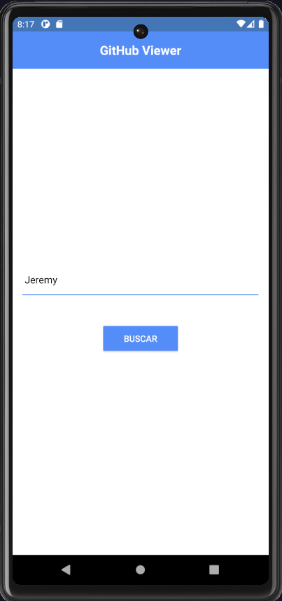
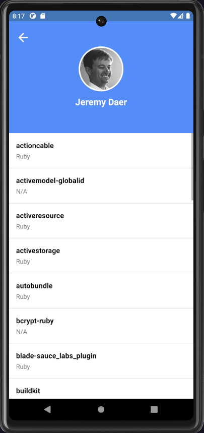

# GitHub Viewer - Buscador de Perfis

<p align="center">
  
  &nbsp;&nbsp;&nbsp;&nbsp;
  
</p>

## 📱 Sobre o Projeto

GitHub Viewer é um aplicativo móvel desenvolvido em React Native que permite aos usuários buscar e visualizar perfis do GitHub. O app exibe informações como nome, foto do usuário e lista todos os seus repositórios com suas respectivas linguagens de programação.

## 🚀 Funcionalidades

- **Busca de Usuários**: Pesquisa por qualquer usuário do GitHub através do username
- **Visualização de Perfil**: Exibe foto e nome do usuário
- **Lista de Repositórios**: Mostra todos os repositórios do usuário com suas linguagens
- **Tratamento de Erros**: 
  - Feedback para usuário não encontrado
  - Mensagens de erro de conexão
  - Validação de campos
- **Interface Responsiva**: Layout adaptável a diferentes tamanhos de tela

## 🛠 Tecnologias Utilizadas

- [React Native](https://reactnative.dev/)
- [Styled Components](https://styled-components.com/)
- [React Navigation](https://reactnavigation.org/)
- [GitHub API](https://docs.github.com/en/rest)
- [Vector Icons](https://github.com/oblador/react-native-vector-icons)
- [Async Storage](https://react-native-async-storage.github.io/async-storage/)

## 📦 Instalação e Execução

> **Nota**: Certifique-se de ter configurado o ambiente React Native conforme a [documentação oficial](https://reactnative.dev/docs/environment-setup).

### Pré-requisitos

- Node.js
- npm ou yarn
- React Native CLI
- Android Studio (para Android)
- Xcode (para iOS)

### Passo 1: Clone o Repositório

```bash
git clone https://github.com/seu-usuario/github-viewer.git
cd github-viewer
Passo 2: Instale as Dependências
BASH

npm install
# ou
yarn install
Passo 3: Inicie o Metro
BASH

npm start
# ou
yarn start
Passo 4: Execute o Aplicativo
Para Android:

BASH

npm run android
# ou
yarn android
Para iOS:

BASH

cd ios && pod install && cd ..
npm run ios
# ou
yarn ios
💻 Comandos Úteis para Desenvolvimento
r - recarrega o app
d - abre o menu de desenvolvimento
j - abre o DevTools
📱 Estrutura do Projeto

src/
  ├── components/          # Componentes reutilizáveis
  │   ├── Alert/
  │   ├── Button/
  │   ├── SearchBar/
  │   └── UserCard/
  ├── screens/            # Telas do app
  │   ├── Home/
  │   └── Profile/
  ├── services/          # Serviços e API
  ├── styles/           # Estilos globais
  └── utils/           # Utilitários
🔍 Funcionalidades Detalhadas
Tela Inicial (Home)
Campo de busca para username do GitHub
Tratamento de erros com mensagens claras
Feedback visual durante a busca
Tela de Perfil
Exibição do avatar do usuário
Nome/username do usuário
Lista scrollável de repositórios
Indicação das linguagens utilizadas
🐛 Tratamento de Erros
O app inclui tratamento para os seguintes casos:

Usuário não encontrado
Erro de conexão com a internet
Campo de busca vazio
Limite de requisições da API excedido
🤝 Como Contribuir
Faça um fork do projeto
Crie uma branch para sua feature (git checkout -b feature/AmazingFeature)
Commit suas mudanças (git commit -m 'Add some AmazingFeature')
Push para a branch (git push origin feature/AmazingFeature)
Abra um Pull Request
📝 Licença
Este projeto está sob a licença MIT. Veja o arquivo LICENSE para mais detalhes.

🔧 Solução de Problemas
Se encontrar problemas durante a instalação ou execução, tente:

Limpar o cache do Metro:
BASH

npm start -- --reset-cache
Reinstalar os módulos:
BASH

rm -rf node_modules
npm install
Para iOS, reinstalar pods:
BASH

cd ios
pod deintegrate
pod install
📚 Links Úteis
Documentação React Native
Documentação da API do GitHub
Guia de Estilo React Native
👨‍💻 Autor
Seu Fabio Sena - https://github.com/fabiosena1436 - https://www.linkedin.com/in/fabio-vicente-de-sena/

🙏 Agradecimentos
React Native Community
GitHub API